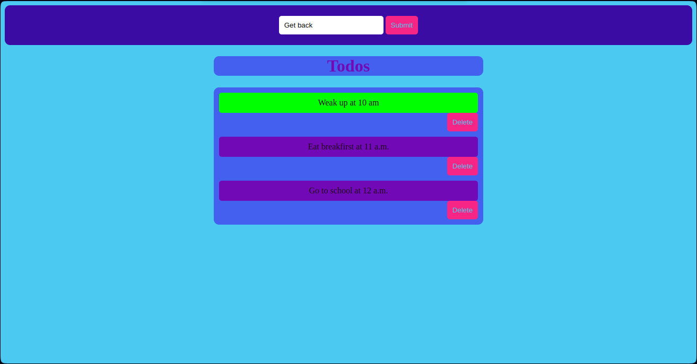

# TodoList


> A simple and interactive task management web application built with JavaScript.



## Table of Contents

- [Features](#features)
- [Getting Started](#getting-started)
  - [Prerequisites](#prerequisites)
  - [Installation](#installation)
- [Usage](#usage)
- [Roadmap](#roadmap)
- [Contributing](#contributing)
- [License](#license)
- [Contact](#contact)
- [Acknowledgements](#acknowledgements)

## Features

- Add new tasks.
- Mark tasks as done.
- Delete tasks.

## Getting Started

### Prerequisites

- A modern web-browser like Safari, Chrome, Microsoft-Edge, Mozilla Firefox, etc. 

### Installation

1. Clone the repository
```bash
 git clone https://github.com/ItsPinion/TodoList.git
```

2. Change the directory
```bash
cd TodoList
```


## Usage

- Open `index.html` in your favorite browser
- Add tasks using the input field
- Mark tasks as done by clicking on them
- Delete tasks using the delete button

## Roadmap

See the [open issues](https://github.com/ItsPinion/TodoList/issues) for a list of proposed features (and known issues).

## Contributing

Contributions are what make the open source community such an amazing place to learn, inspire, and create. Any contributions you make are **greatly appreciated**. Please have a look at the [contribution guidelines](CONTRIBUTING.md) first.

## License

Distributed under the MIT License. See [LICENSE](LICENSE.md) for more information.

## Contact

- GitHub [@ItsPinion](https://github.com/ItsPinion)

## Acknowledgements

- [Best-README-Template](https://github.com/othneildrew/Best-README-Template)
- [Awesome README](https://github.com/matiassingers/awesome-readme)
- [Shield.io](https://shields.io/)

